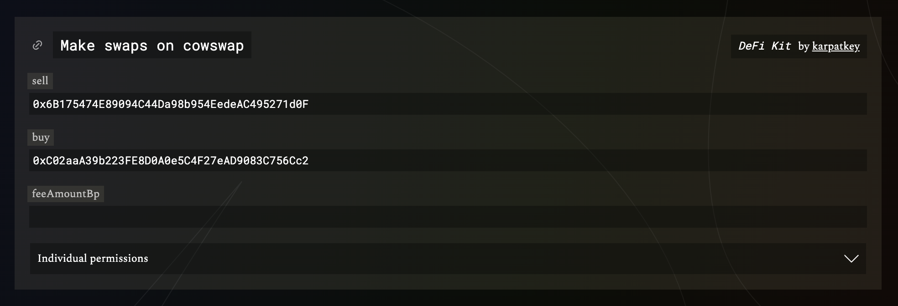

# Annotations

Managing and auditing large sets of permissions can be difficult.
To address this challenge, we've introduced the ability to add permission annotations to roles.
Annotations provide a way to group permissions and attach additional context, making it easier to understand and manage.

An annotation is defined by two fields:

- `uri` - An identifier specifying the subset of permissions to be annotated. A `GET` request to this URI is expected to return an array of permissions.
- `schema` - The URL of an OpenAPI v3 schema document describing the API, including the endpoint specified in `uri`.

Annotations, being an auxiliary concept, are not stored in the Roles contract. Instead, they are posted to the blockchain via [Poster](https://eips.ethereum.org/EIPS/eip-3722) to become accessible to the Roles subgraph.

## Resolving Annotations

The Roles app resolves annotations by fetching the permissions to be annotated from the specified `uri` as well as the corresponding `schema` document.

If the permissions returned from the `uri` are a subset of the permissions granted to the role, the annotation will be applied, otherwise it will be ignored.

From the `schema` document, the Roles app extracts the [Operation object](https://swagger.io/specification/#operation-object) of the `uri` endpoint.
This information guides the generic rendering of the annotated permission set in the app.

## Example

The [DeFi Kit](https://kit.karpatkey.com) project curates permission sets for common interactions with different DeFi protocols.
It uses annotations to indicate which permissions belong to a certain protocol action.

For example, a `swap` action of the `cowswap` protocol would be annotated as follows:

```json
{
  "uri": "https://kit.karpatkey.com/api/v1/permissions/eth/cowswap/swap?sell=0x6B175474E89094C44Da98b954EedeAC495271d0F&buy=0xC02aaA39b223FE8D0A0e5C4F27eAD9083C756Cc2",
  "schema": "https://kit.karpatkey.com/api/v1/openapi.json"
}
```

The `uri` includes all parameters of the DeFi Kit action returns the resulting set of permissions:

https://kit.karpatkey.com/api/v1/permissions/eth/cowswap/swap?sell=0x6B175474E89094C44Da98b954EedeAC495271d0F&buy=0xC02aaA39b223FE8D0A0e5C4F27eAD9083C756Cc2

The schema information allows the Roles app to render the annotated permission set in an abstracted, user friendly way:



Live example: https://roles.gnosisguild.org/permissions/eth/QDvRwxK23piKZ1EdbZgrXP2MydB2tEa2JqWLHIzk
