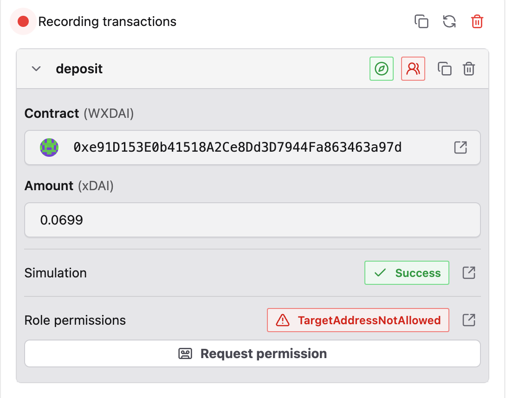
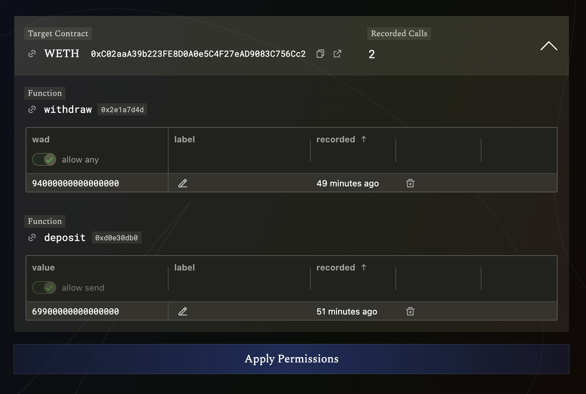
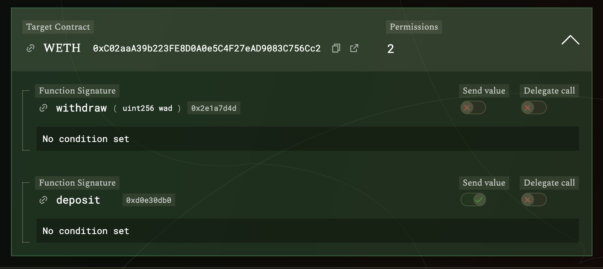

import { Callout } from "nextra/components";

# Lower Safe Threshold for Routine Transactions

This tutorial walks you through setting up a reduced signing threshold for frequent, low-risk transactions using Zodiac Roles and Zodiac Pilot. You'll learn how to create a more efficient workflow for routine operations while maintaining security for critical transactions.

## Problem Statement

You have an existing 3/5 Safe and find it cumbersome to coordinate between signers for every single transaction. You'd like to make it more efficient to execute frequent, low-risk actions by reducing the threshold to 2/5 for these specific operations.

## Solution Overview

**Approach:** Define a role and assign it to a Safe with the same set of owners but reduced threshold. Record the low-risk calls through Zodiac Pilot and whitelist them for the role. Use Zodiac Pilot to execute through the new role.

This approach allows you to:

- Maintain the 3/5 threshold for critical transactions
- Use a 2/5 threshold for routine, low-risk operations
- Automatically route transactions through the appropriate Safe based on permissions
- Maintain full control over which operations are considered "low-risk"

## Prerequisites

- A 3/5 Safe with existing owners
- A web3 wallet (MetaMask, Rabby, etc.) for signing transactions as one of the Safe owners
- Basic familiarity with Safe operations

## Step 1: Set Up Reduced Threshold Safe

First, we need to create a new Safe with the same owners but a lower threshold.

1. Go to [https://app.safe.global/new-safe/create](https://app.safe.global/new-safe/create)
2. Deploy a new Safe on the same chain as your main 3/5 Safe
3. Assign the **same set of owners** as your main Safe
4. Set the threshold to `2` instead of `3`
5. Complete the Safe deployment process

<Callout type="info">
  This new Safe will serve as the execution vehicle for your reduced-threshold
  operations. It maintains the same ownership structure as your main Safe but
  requires fewer signatures for execution.
</Callout>

## Step 2: Choose a Role Name

Roles are identified by a label of up to 32 characters. We need to encode this label properly.

1. **Pick a descriptive name** for your role (e.g., `routine_ops`)
2. **Use only these characters:** a-z, 0-9, \_ (underscore)
3. **Convert to bytes32:** Use the [Deth Tools String to Bytes32 Converter](https://tools.deth.net/string-bytes32-conversion)
4. **Record the encoded value** - you'll need this in the next step

**Example:**

- Role name: `routine_ops`
- Encoded value: `0x726f7574696e655f6f7073000000000000000000000000000000000000000000`

## Step 3: Enable Roles Modifier on Main Safe

Now we'll add the Zodiac Roles Modifier to your main Safe and assign the role to the reduced-threshold Safe.

### 3.1 Add the Roles Modifier

1. Open your main 3/5 Safe in Safe\{Wallet\}
2. Navigate to the **Apps** section
3. Find and open the **Zodiac Safe app**
4. Select the **Roles Modifier**
5. Keep all default configuration options
6. Click **Add Module**
7. Have all other main Safe owners confirm this transaction

### 3.2 Assign Role to Reduced-Threshold Safe

1. Once confirmed, go back into the **Zodiac Safe app**
2. Select the **Roles Modifier (v2)** in the left panel
3. Switch to the **Write Contract** tab
4. Select the **assignRoles** function from the list
5. Fill in the parameters:
   - **`module`**: Enter the address of the Safe you created in Step 1
   - **`roleKeys`**: Enter `["<your_bytes32_encoded_role_key>"]`
     - Example: `["0x726f7574696e655f6f7073000000000000000000000000000000000000000000"]`
   - **`memberOf`**: Enter `[true]`
6. Click **Add this transaction**
7. Click **Bundle Transaction** in the top right
8. Click **Submit Transactions** at the bottom
9. Have all other main Safe owners confirm this transaction

<Callout type="info">
  The `assignRoles` function grants the specified role to the target Safe. The
  `memberOf` parameter set to `[true]` means the Safe will be a member of the
  role, allowing it to execute transactions that match the role's permissions.
</Callout>

## Step 4: Set Up Zodiac Pilot for Execution

Zodiac Pilot will handle the routing logic to let you execute through the role and the 2/5 role member Safe.

### 4.1 Install Zodiac Pilot & Add Account

1. Install the [Zodiac Pilot browser extension](https://pilot.gnosisguild.org)
2. Launch the extension and click _Add account_ at the bottom of the extension panel
3. Select the chain and enter the address of your main 3/5 Safe. You should also give it a descriptive label.
4. Confirm by clicking _Create_. It should now show the Safe account in the extension panel.

<Callout type="info">
  Zodiac Pilot is a browser extension that acts as a smart execution interface.
  It can automatically route transactions through different execution paths
  based on permissions and roles.
</Callout>

### 4.2 Configure Execution Routes

1. Click **Complete route setup to sign** at the bottom of the Pilot panel
2. In the **Pilot Signer** field, select your own EOA from the list of Safe owners
3. Under **Selected route**, you'll see two execution options:
   - **Execution through the role** - requires only 1 additional signature
   - **Direct execution from main 3/5 Safe** - requires 2 additional signatures
4. Select the route through the **2/5 Safe and Roles mod**
5. Click **Save** to confirm the configuration

<Callout type="info">
  Pilot will automatically route transactions through the appropriate Safe based
  on whether the transaction is permitted by the role. Permitted transactions go
  through the 2/5 Safe, while non-permitted transactions require the full 3/5
  Safe approval.
</Callout>

## Step 5: Whitelist Calls for the Role

Now we'll record and whitelist the specific operations you want to allow with reduced threshold.

### 5.1 Record Transaction Calls

1. Connect to any dApp with Pilot (just like any other browser wallet)
2. For this example, we'll allow wrapping and unwrapping ETH
3. Go to [https://www.wrapeth.com](https://www.wrapeth.com) and ensure Pilot is connected
4. On the **Wrap ETH** tab:
   - Enter a value within your Safe's current balance
   - Submit the transaction
   - A `deposit` call will be recorded in the Pilot panel
   - Click **Request permission** for this call
5. On the **Unwrap WETH** tab:
   - Enter any value and submit
   - A `withdraw` call will be recorded
   - Click **Request permission** for this call as well

<Callout type="info">
  Pilot records the exact function calls and parameters you attempt. This allows
  you to create precise permissions that match your intended use cases.
</Callout>

### 5.2 Configure Permissions

1. Click **View requested permissions** in the Pilot panel
2. You'll be taken to the Roles app showing both recorded calls
3. By default, permissions allow only the exact parameter values recorded
4. For the `withdraw` call, enable **allow any** on the `wad` parameter to allow arbitrary withdrawal amounts
5. For calls with ETH value, the **allow send** toggle should already be enabled
6. Click **Apply Permissions** to proceed

<Callout type="info">
  The "allow any" toggle makes the permission more flexible by allowing any
  value for that parameter, rather than just the specific value you recorded.
  This is useful for operations where you want to allow variable amounts.
</Callout>

### 5.3 Execute Permission Assignment

1. You'll be redirected to the Roles app in Safe\{Wallet\} of your main 3/5 Safe
2. Review the permissions that will be applied
3. Close the Pilot panel so your browser wallet can connect to Safe\{Wallet\}
4. Click **Execute** to submit the transaction
5. Gather the required 3 signatures from your main Safe owners

<Callout type="info">
  After this step, your role will have permission to wrap and unwrap ETH with
  only 2 signatures instead of 3.
</Callout>

## Step 6: Execute Transactions Through the Role

Now you can execute the whitelisted operations with reduced threshold.

### 6.1 Execute a Wrapped Transaction

1. Open the Pilot extension panel
2. Go to [https://www.wrapeth.com](https://www.wrapeth.com) and trigger a wrap/unwrap action
3. Pilot will show a successful permission check
4. Click **Sign** at the bottom of the Pilot panel
5. Review the transaction details
6. Click **Connect Pilot Signer** at the top right
7. Click **Sign** to submit the transaction to the 2/5 Safe

### 6.2 Confirm and Execute

1. Ask one of your co-signers to open the 2/5 Safe
2. They'll see the pending transaction in the queue
3. Have them confirm and execute the transaction
4. The transaction will be processed with only 2 signatures instead of 3

## Recap and Next Steps

Congratulations! You've successfully set up a lower signing threshold for wrapping and unwrapping ETH. Here's what you've accomplished:

### What You Built

- **Dual Threshold**: A main 3/5 Safe for critical operations and a 2/5 Safe for routine tasks
- **Role-Based Permissions**: Specific permissions for low-risk operations
- **Automatic Routing**: Pilot automatically routes transactions to the appropriate Safe
- **Reduced Coordination**: Routine operations now require only 2 signatures instead of 3

### Key Benefits

- **Efficiency**: Faster execution of routine transactions
- **Security**: Critical operations still require full consensus
- **Flexibility**: Easy to add or remove permissions as needed
- **Transparency**: Clear onchain audit trail of all permissions and operations

### Expanding the System

You can extend this system by:

1. **Adding More Permissions**: Record and whitelist additional low-risk operations
2. **Single Signer Operations**: For very low-risk actions, you could assign roles directly to individual addresses (no additional Safe needed)
3. **Multiple Roles**: Create multiple roles with different sets of members, even beyond the owners of the main Safe.

This setup provides a powerful balance between operational efficiency and security, allowing your organization to move faster on routine operations while maintaining strict controls on critical decisions.
